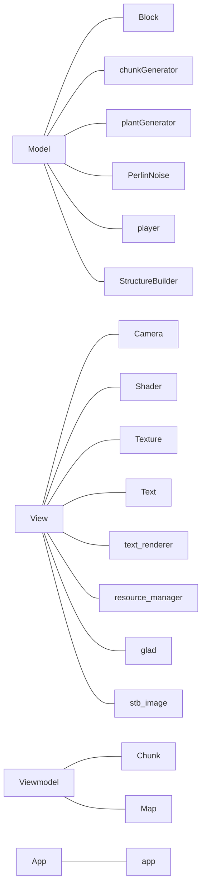

<strong>Minecraft组结题报告</strong>
 

周寒靖、尹浩霖、郑昱笙

# 项目简介

### 项目描述

​		参考3D沙盒游戏minecraft（中文名：我的世界），做一个简易版minecraft。玩家根据第一视角可在生成的有限随机地图中随意移动，损毁方块或放置方块，搭建属于自己的方块世界。

### 操作规则

1、开启游戏：在游戏开始界面中按“Enter”键

2、位置移动：在当前视角方向下，“W”键向前、“S”键向后、“A”键向左，“D”键向右，“Q”键向上，“Z”键向下

3、第一视角移动：运用鼠标的移动可以改变玩家第一视角

4、方块放置与损毁：鼠标右键仿放置方块，鼠标左键销毁方块

5、放置方块转换：“1”键换soil，“2”键换stone，“3”键换stone brick，“4”键换sand，“5”键换bark，“6”键换cactus

# 项目需求

### 基本目标

1、实现基本地形生成

2、实现摄像机漫游

3、实现方块的放置和破坏

### 高级选项

1、实现无限地形、可重入的地形存储系统

2、丰富的方块类型

3、背包系统

# 项目开发

### 迭代计划

|      | 第一轮迭代                   | 第二轮迭代                                                   | 第三轮迭代                     |
| :--: | ---------------------------- | ------------------------------------------------------------ | ------------------------------ |
| 用时 | 4天                          | 3天                                                          | 4天                            |
| 成果 | 实现基本地形生成、摄像机漫游 | 扩增多种地形、增加植物群系、优化随机的地表高度（使其更符合自然地势） | 实现基本的的方块放置和破坏功能 |

### 开发技术和工具

|          |          工具           |
| -------- | :---------------------: |
| 编程语言 |          C++17          |
| 开发环境 |   visual studio 2019    |
| 开发系统 |         Windows         |
| 版本控制 |       Git，Github       |
| 持续集成 |         Jenkins         |
| 相关库   | openGL、glm、freetype等 |
| 开发模式 |          MVVM           |
| 交流协作 |           QQ            |

### 小组分工

周寒靖：view层和文档管理

郑昱笙：common层和APP层

尹浩霖：viewmodel层和model层

# 项目成果

### 游戏效果图

1、封面

<table>
    <tr>
     <td>

        
        

        

        图1 封面
        
</td> 
    </tr>
</table>

2、不同地形各处风景

<table>
    <tr>
     <td>

        
        

        

        图2 斜坡与植物群
        
</td> 
        <td>

        
        

        

        图3 森林与植物群
        
</td> 
    </tr>
    <tr>
     <td>

        
        

        

        图4 仰视云朵
        
</td> 
        <td>

        
        

        

        图5 海边风景
        
</td> 
    </tr>
</table>

3、放置与损毁方块

<table>
    <tr>
     <td>

        
        

        

        图6 放置不同类型的方块
        
</td> 
        <td>

        
        

        

        图7 销毁草地方块
        
</td> 
    </tr>
</table>

### 代码框架

# 项目总结

### 已实现的需求

1、基本随机地形生成

2、摄像机漫游

3、方块的放置和破坏

4、6种可放置的方块类型，且可相互更换

5、开始界面

### 优化空间探讨

1、无限地形渲染。过大的地形会影响项目运行速度，所以需要即时渲染，即只渲染用户看得见的区域。当用户移动时，已变成不可见区域的渲染内存应当回收，用于渲染新生成的可见区域。这样才能不断生成地形即实现无限地形，又不导致运行速度过慢/内存崩溃。这一块内容涉及内存管理，还有待优化提高。

2、背包系统。目前的项目中，玩家当前手持的方块类型由黑色的命令窗口输出，并未实现背包系统。背包系统要在当前界面中新增UI，需要更深层次的openGL图形学知识，所以暂未实现。

3、本项目除了代码逻辑外，一个难点是有关openGL库的图形学知识。如果直接使用游戏引擎如unity3D，可以省去图形学的基础代码，专注于游戏逻辑本身，也许能实现地更好。

# 参考资料

1、https://learnopengl-cn.github.io/

2、[https://github.com/Hopson97/MineCraft-One-Week-Challenge](https://github.com/Hopson97/MineCraft-One-Week-Challenge) 

3、https://www.bilibili.com/video/BV1ux411H7ZE/?spm_id_from=333.788.videocard.1